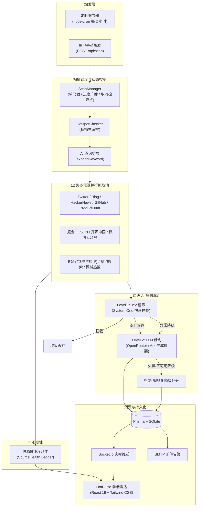

# HotPulse · AI 热点雷达 (AI Hotspot Monitor)

> 专为技术从业者与内容创作者打造的全网多信源技术热点智能聚合、判定与实时监控系统。

---

## 📌 项目概述

**HotPulse** 是一款基于 Node.js + React 的全自动化技术热点监控与研判系统。用户只需配置关注的技术关键词（如大模型、前端框架、开源工具等），系统便会按计划自动并行抓取全网主流信息源，利用 AI 大模型进行查询扩展、真实性核验、相关性判定与价值提炼，并通过 WebSocket 和邮件渠道第一时间推送高价值热点。

本项目在既有架构基础上进行了深度二次开发与生产级工程重构：
- **信源扩展**：从原有的基础信息源扩充至 **12 路全网信源**；
- **AI 抽象**：解除单一供应商绑定，抽象 **OpenAI 兼容协议** 并原生支持 **OpenRouter** 与 **火山方舟（ByteDance Ark）**；
- **成本优化**：引入 **Jev System One 决策预筛** 两级漏斗过滤机制，大幅降低大模型调用开销；
- **可观测性**：新增 **信源健康度账本** 与前端动态告警，根除爬虫静默失败盲区；
- **体验升级**：重塑现代化 **HotPulse UI**，支持浅色/深色主题无缝切换与扫描状态控制机。

---

## ✨ 核心特性

### 1. 12 路多信源并行聚合
系统支持国内外主流技术社区、搜索引擎与社交平台的全方位覆盖，单信源故障自动隔离，不影响全局扫描：
- **海外信源**：Twitter/X (API)、Bing 网页搜索、HackerNews、Product Hunt (Atom RSS)、GitHub (官方 API Trending/Repos)
- **国内开发者社区**：掘金（Juejin 推荐流）、CSDN、开源中国（OSChina 资讯）、微信公众号（搜狗微信）
- **国内综合平台**：Bilibili（含视频与 UP 主动态检测）、搜狗搜索、微博热搜

### 2. AI Provider 解耦抽象（OpenAI 兼容协议）
- **多模型平台支持**：统一基于 OpenAI 兼容协议封装，支持环境变量 `AI_PROVIDER` 一键切换 **OpenRouter** 或 **火山方舟（ByteDance Ark）**，并可通过 `AI_BASE_URL` 轻松桥接私有大模型网关。
- **查询扩展（Query Expansion）**：扫描前利用 AI 对关键词进行语义发散，提升长尾和相关技术事件的检索召回率。
- **高可用降级兜底**：当大模型欠费、限流（429）或网络不可用时，系统自动切换为规则化打分算法（Rule-based Fallback），保障抓取与入库流水线不中断。

### 3. Jev 决策预筛（可选两级漏斗机制）
- **两级过滤架构**：
  1. **Level 1（快速粗筛）**：基于 Jev（TypeSafe System One，通过 QuickRouter 端点）执行超快结构化决策判定，对低真实度或零相关性内容进行拦截，**零 LLM 文本生成开销**；
  2. **Level 2（深度精判）**：仅对通过粗筛的候选内容调用 LLM 执行全量精判并生成中文核心摘要与关键见解。
- **无缝容灾**：Jev 出现网络或接口异常时，系统自动无感知降级至 LLM 全量分析。

### 4. 信源健康度可观测账本（Source Health）
- **全链路状态监控**：内存态记录每轮扫描中 12 个信源的调用结果、抓取条数、耗时及具体异常错误。
- **拒绝静默失败**：通过 `GET /api/scan/health` 暴露接口并在前端实时呈现告警横幅，彻底区分“本轮无匹配热点”与“信源反爬/Token失效导致的抓取失败”。

### 5. 现代化 HotPulse UI
- **双主题支持**：提供专为内容阅读设计的 Apple Light 浅色主题与沉浸式 Dark 深色主题，首屏防闪烁（Anti-FOUC）。
- **热度与重要度量化**：
  - **热度指数**：综合转评赞藏与浏览量加权对数压缩计算，直观呈现“冷 / 凉 / 温 / 热 / 爆”等级；
  - **重要度分级**：紧急、重要、一般、低四级标记，支持一键展开/折叠 AI 研判理由。
- **多维筛选与排序**：支持按来源、重要度、时间跨度、真实性快速过滤，并按发现时间、发布时间、热度综合或相关性排序。
- **扫描状态控制机**：带并发单飞锁保护的扫描触发，实时同步百分比进度条与步骤，支持中途安全取消。

### 6. 多通道实时推送
- **WebSocket 实时流**：基于 Socket.io，新抓取热点和扫描状态毫秒级直推前端。
- **SMTP 邮件告警**：对紧急/高重要度热点自动触发邮件通知，防止关键技术突发动态遗漏。

### 7. Agent Skills 技能包
- 内置 `skills/hot-monitor` 自包含技能规范，可直接挂载到 Cursor、Claude Code、VSCode Copilot 等智能编程助手作为原生热点调研工具。

---

## 🏗️ 系统架构



---

## 🛠️ 技术栈

| 层次 | 核心技术 | 作用说明 |
|:---|:---|:---|
| **前端应用** | React 19, TypeScript, Vite 7 | 核心页面开发与组件化 |
| **样式与交互** | Tailwind CSS v4, Framer Motion, Lucide React | 响应式布局、动效与图标、双主题适配 |
| **实时通信** | Socket.io Client | 扫描进度与新热点实时推流 |
| **服务端框架** | Node.js (≥18/20 LTS), Express 5 | 高性能 REST API 与服务端路由 |
| **任务调度** | node-cron | 定时任务调度（每 2 小时自动抓取） |
| **数据持久化** | Prisma ORM, SQLite | 轻量级本地数据存储与迁移 |
| **网络采集** | Axios, Cheerio, Native Fetch | 网页解析、RSS 解析与第三方 API 抓取 |
| **AI 提供商** | OpenRouter, 火山方舟 (ByteDance Ark) | 大模型分析、关键词扩展与摘要提取 |
| **预筛决策** | Jev (TypeSafe System One / QuickRouter) | 低延迟、低成本的一级判定过滤 |
| **测试套件** | Vitest | 单元测试与端到端集成测试 |

---

## 🚀 快速启动

### 1. 环境准备

- **Node.js**：≥ 18（推荐 Node.js 20 LTS 或更高版本）
- **npm**：≥ 9
- **AI 凭证**：获取 [OpenRouter API Key](https://openrouter.ai/settings/keys) 或 [火山方舟 Ark API Key](https://console.volcengine.com/ark)（二选一即可）

### 2. 克隆项目与安装依赖

```bash
git clone <your-repo-url>
cd yupi-hot-monitor

# 安装服务端依赖
cd server
npm install
npx prisma generate
npx prisma db push

# 安装前端依赖
cd ../client
npm install
```

### 3. 配置环境变量

复制后端环境变量模板：

```bash
cp server/.env.example server/.env
```

编辑 `server/.env`，根据所选的 AI 服务填入配置（以 OpenRouter 或火山方舟为例）：

```env
# 端口与服务
PORT=3001
CLIENT_URL=http://localhost:5173
DATABASE_URL="file:./dev.db"

# ==================== AI 提供商配置 ====================
# 可选值: openrouter | ark (默认 openrouter)
AI_PROVIDER=openrouter

# 方案 A: 使用 OpenRouter
OPENROUTER_API_KEY=sk-or-v1-xxxxxxxxxxxx

# 方案 B: 使用火山方舟 Ark (取消注释使用)
# AI_PROVIDER=ark
# ARK_API_KEY=xxxxxxxx-xxxx-xxxx-xxxx-xxxxxxxxxxxx
# ARK_MODEL=doubao-seed-1-6

# ==================== Jev 决策预筛（可选） ====================
# JEV_ENABLED=true
# JEV_API_KEY=your_quickrouter_or_openrouter_key
# JEV_BASE_URL=https://api.quickrouter.ai
# JEV_MODEL=jev-1.13.0

# ==================== 信源额外 Key（可选） ====================
# Twitter API (twitterapi.io，若无 Key 则该源自动跳过)
TWITTER_API_KEY=

# GitHub API Token (配置后可避免公开 IP 速率受限)
# GITHUB_TOKEN=

# ==================== 邮件通知（可选） ====================
SMTP_HOST=smtp.example.com
SMTP_PORT=587
SMTP_USER=your_email@example.com
SMTP_PASS=your_password
NOTIFY_EMAIL=recipient@example.com
```

### 4. 启动服务

开启两个独立终端分别启动服务端与前端：

```bash
# 终端 1：启动服务端 (端口: 3001)
cd server
npm run dev

# 终端 2：启动前端应用 (端口: 5173)
cd client
npm run dev
```

启动完成后，在浏览器访问 **`http://localhost:5173`** 即可进入 HotPulse 热点雷达控制台。

| 服务组件 | 访问地址 | 说明 |
|:---|:---|:---|
| **前端看板** | `http://localhost:5173` | 热点信息流、关键词管理与扫描控制 |
| **后端 API** | `http://localhost:3001` | REST API 服务与 WebSocket 服务端点 |
| **Prisma Studio** | 在 server 目录运行 `npm run db:studio` | 本地数据库可视化控制台（可选） |

---

## 🧪 自动化测试与连通性验证

项目配备了完善的测试套件与独立的信源/AI 验证脚本，方便排查环境与第三方服务状态：

### 1. 运行单元与集成测试

```bash
cd server
npm test
```

### 2. 独立验证脚本

针对外部信源、AI 提供商及 Jev 服务的独立排查工具：

```bash
cd server

# 验证 6 个新增信源（掘金/CSDN/开源中国/GitHub/ProductHunt/微信）对特定词的抓取能力
npx tsx src/scripts/verifyNewSources.ts DeepSeek

# 验证当前配置的 AI 提供商（OpenRouter 或 Ark）的连接与模型调用
npx tsx src/scripts/verifyAiConnection.ts

# 验证 Jev 决策预筛链路（Jev 粗筛 + LLM 精判）
npx tsx src/scripts/verifyJevConnection.ts
```

---

## 📡 核心 API 端点速查

| 请求方法 | 路径 | 功能说明 |
|:---|:---|:---|
| `GET` | `/api/hotspots` | 分页获取热点列表，支持多条件筛选与排序 |
| `GET` | `/api/hotspots/stats` | 获取热点统计数据（总数、今日新增、各源分布等） |
| `POST` | `/api/hotspots/search` | 输入关键词执行即时全网聚合搜索与 AI 分析 |
| `GET` | `/api/keywords` | 获取所有已配置的监控关键词列表 |
| `POST` | `/api/keywords` | 添加新的监控关键词 |
| `POST` | `/api/scan` | 触发一轮全量热点扫描（带单飞锁防并发） |
| `POST` | `/api/scan/cancel` | 请求安全取消当前正在进行的扫描 |
| `GET` | `/api/scan/status` | 查询当前扫描状态与执行进度（百分比/阶段） |
| `GET` | `/api/scan/health` | **查询本轮扫描中 12 个信源的健康度与故障详情** |
| `GET` | `/api/notifications` | 获取通知消息列表 |

---

## 📂 项目结构

```
yupi-hot-monitor/
├── client/                      # 前端项目 (React 19 + Vite)
│   ├── src/
│   │   ├── components/          # UI 业务组件 (FilterSortBar, ThemeToggle 等)
│   │   ├── services/            # 前端 API 与 WebSocket 客户端封装
│   │   ├── utils/               # 热度计算、排序与相对时间格式化
│   │   ├── App.tsx              # 主应用界面 (HotPulse UI)
│   │   └── main.tsx
│   └── package.json
├── server/                      # 后端服务 (Express 5 + Prisma)
│   ├── prisma/                  # SQLite 数据库 Schema 与数据库定义
│   ├── src/
│   │   ├── jobs/                # 扫描执行编排 (hotspotChecker) 与状态管理器 (scanManager)
│   │   ├── routes/              # API 路由 (hotspots, keywords, scan, notifications)
│   │   ├── services/            # 核心领域服务
│   │   │   ├── ai.ts            # AI 调度 (查询扩展、内容审核、Jev 粗筛接入)
│   │   │   ├── aiProvider.ts    # AI Provider 抽象层 (OpenRouter / Ark)
│   │   │   ├── jevClient.ts     # Jev 结构化决策预筛客户端
│   │   │   ├── sourceHealth.ts  # 信源健康度账本 (内存态)
│   │   │   ├── newSources.ts    # 新增 6 信源抓取适配器
│   │   │   ├── search.ts        # 全球信源采集器
│   │   │   └── chinaSearch.ts   # 国内综合信源采集器
│   │   ├── scripts/             # 独立排查与连通性验证脚本
│   │   └── __tests__/           # Vitest 单元与集成测试用例
│   └── package.json
├── skills/                      # Agent Skills
│   └── hot-monitor/             # 热点监控技能包 (供 Cursor / Claude Code 使用)
├── docs/                        # 项目说明与配置指南
│   ├── LOCAL_SETUP.md           # 本地详细运行指南
│   └── vibe/                    # 架构决策记录、技术规范与需求追踪
└── README.md
```

---

## 📄 授权协议

本项目采用 [MIT](LICENSE) 协议开源。
