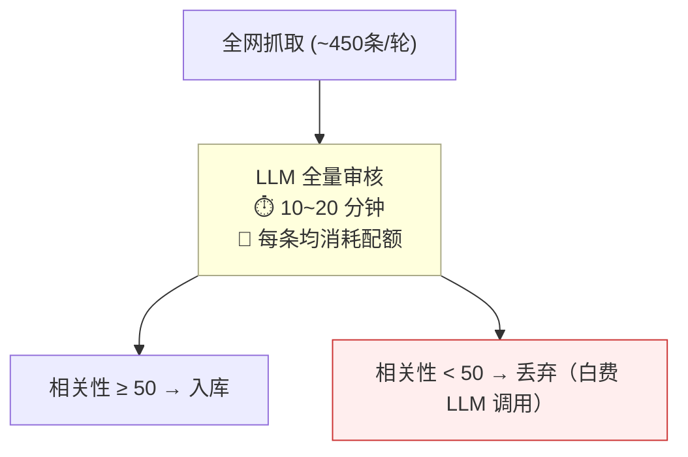
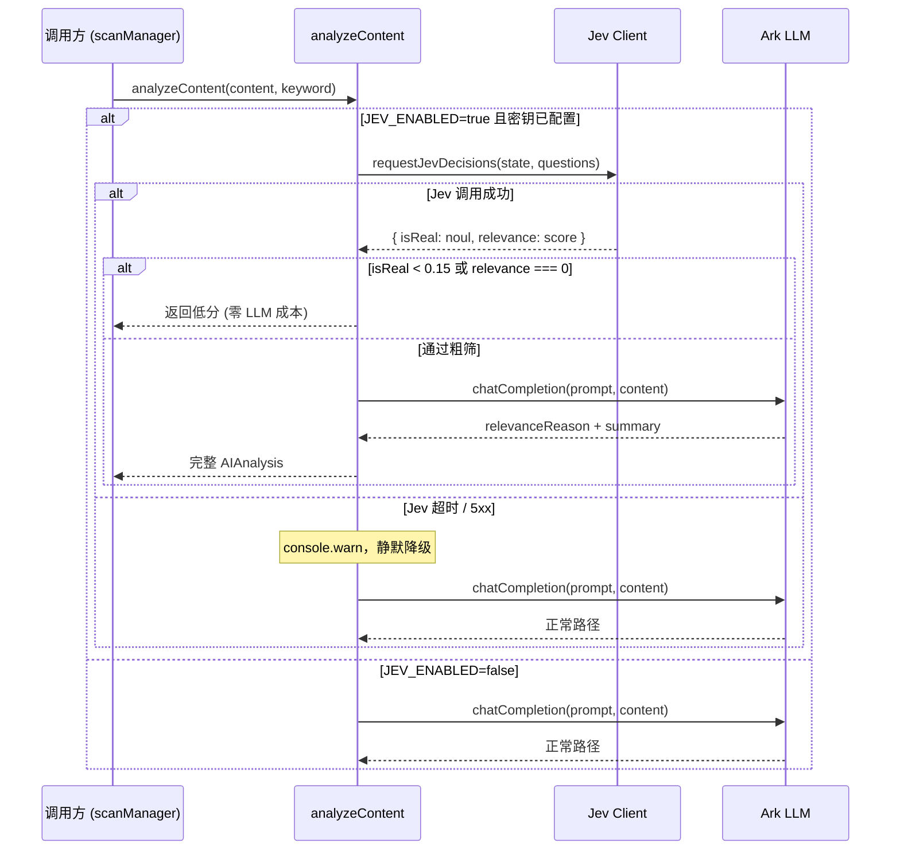

# Jev 模型在热点监控中的最佳实践：用判别式 AI 砍掉 80% 的无效 LLM 调用

大家好，我是不会喷火的小火龙。

## 本节重点

本节以真实开源项目 `yupi-hot-monitor`（全网热点监控系统）为实战场景，带大家把 TypeSafe 刚发布的 System One 模型 Jev 接入生产环境。不只讲概念，有代码、有踩坑、有真实跑出来的数据。

完成本节你会学到：

1) Jev 是什么，为什么它不生成任何自然语言文本却能跑赢 LLM 两个数量级；
2) 官方三大决策原语 Choice / Noul / Score 的工作方式，以及怎么用 TypeScript 封装；
3) 怎么把单级 LLM 审核流水线改造成 Jev 粗筛 + LLM 精判的两级架构；
4) 我们踩过的坑：isReal 打分方差、阈值怎么定、Node.js 代理超时、Ark 429 熔断时 Jev 怎么独立撑着。

---

## 一、背景：一轮扫描 450 条，全量 LLM 跑了 20 分钟

`yupi-hot-monitor` 的工作方式很简单：定时从 GitHub、微信公众号、B 站、掘金等 12 个信源拉取最新内容，然后用 LLM 逐条审核，判断每条内容是否跟用户设定的关键词相关，再把高相关性热点入库展示。

问题出在这个"逐条审核"上。

单轮扫描大约产生 450 条候选内容，每条调一次火山方舟 Ark（DeepSeek 模型），AI 阶段跑下来要 10 到 20 分钟。更麻烦的是，Ark 有 5 小时调用配额限制，跑着跑着就碰到了 `429 Too Many Requests`，整个 AI 审核阶段直接报废。

如图 1 所示，原来的架构里，450 条内容全部排队等 LLM，无论是广告软文还是核心热点，每条都消耗同等的时间和配额：



**图 1：原始单级架构，80% 的 LLM 调用花在明确无关的内容上**

事后看数据，单次全量扫描里约 80% 的条目是明显的营销软文、无关标题党或完全偏题内容。为这些内容请动生成式大模型，只为了让它输出"这条内容不相关，相关性 20 分"，成本和配额都是纯浪费。

---

## 二、Jev 是什么：非自回归判别模型，不生成一个字

遇到这个问题，我翻了一圈方案，最后注意到 TypeSafe AI 在 2026 年 9 月 15 日发布的 Jev。

Jev 属于 System One 模型，这个名字来自卡尼曼《思考，快与慢》里的双系统理论：System 1 负责快速、直觉性的判断，System 2 才是深度推理。大部分生成式 LLM 是 System 2，而 Jev 是 System 1。

如图 2 所示，两者的分工在工程上非常清晰：


**图 2：左侧 Jev 负责瞬间判断，右侧 LLM 负责生成自由文本**

Jev 最本质的差异在于：**它不走自回归生成，不逐 token 输出，也不产生任何自然语言**。你给它一段文本（state）和一批类型化问题（questions），它直接吐出结构化的概率决策。

这带来两个工程上的直接好处：

1) 速度：推理延迟 70~500ms，比常规 LLM 快一两个数量级；
2) 成本：输入按 $0.042/MTok 计费，**输出 token 完全免费**，因为根本没有"输出 token"这个概念。

Jev 的创始人 Diogo Almeida 是前 OpenAI 核心研究员，参与过 InstructGPT 和 RLHF 的早期工作。模型名字来自经济学家杰文斯（Jevons），暗用"杰文斯悖论"：效率提升会带来需求的爆发式增长，他们赌的是这个判别式决策原语会被大规模集成进软件流水线。

---

## 三、官方三大决策原语：Choice、Noul、Score

Jev 只有三种输出类型，文档里称为 primitive（原语）。搞清楚这三个，基本就掌握了 90% 的使用方式。

如图 3 所示，三种原语对应三种判断模式：

```mermaid
classDiagram
    class JevRequest {
        +string model
        +string state
        +JevQuestions questions
    }

    class NoulQuestion {
        +type: 'noul'
        +string instructions
        +criteria: { true: string, false: string }
    }

    class ScoreQuestion {
        +type: 'score'
        +string instructions
        +string[] criteria
    }

    class ChoiceQuestion {
        +type: 'choice'
        +string instructions
        +Record criteria
    }

    class NoulAnswer {
        +type: 'noul'
        +number noul
        +number confidence
    }

    class ScoreAnswer {
        +type: 'score'
        +number score
        +Record probabilities
        +Record legend
    }

    class ChoiceAnswer {
        +type: 'choice'
        +string choice
        +Record probabilities
    }

    JevRequest --> NoulQuestion
    JevRequest --> ScoreQuestion
    JevRequest --> ChoiceQuestion
    NoulQuestion ..> NoulAnswer
    ScoreQuestion ..> ScoreAnswer
    ChoiceQuestion ..> ChoiceAnswer
```

**图 3：Jev 三种决策原语的请求与响应类型结构**

### noul：二值判定

noul 解决的是"是/否"问题，输出一个 0~1 之间的概率浮点数。1 表示"是"，0 表示"否"，中间值表示置信度。

在热点监控里，"这条内容是不是真实有价值的信息（而非营销软文）"就是一个典型的 noul 问题：

```typescript
isReal: {
  type: 'noul',
  instructions: '这段内容是否为真实有价值的信息（排除标题党、假新闻、营销软文）？',
  criteria: { true: '真实有价值', false: '标题党/假新闻/营销软文' }
}
// 返回示例：{ type: 'noul', noul: 0.03 }  // 0.03 = 高概率是垃圾
```

### score：有序打分

score 给内容在一个有序刻度上定位，返回当前刻度的整数值加上各档的概率分布。

关键词相关性很适合用 score：我们定了 4 档（完全无关 / 弱相关 / 直接相关 / 核心主题），Jev 返回 0、1、2、3 中的一个，同时附带每档的概率：

```typescript
relevance: {
  type: 'score',
  instructions: `内容与监控关键词【${keyword}】的直接相关程度`,
  criteria: ['完全无关', '弱相关', '直接相关', '核心主题']
}
// 返回示例：{ type: 'score', score: 0 }  // 完全无关
```

### choice：多分类单选

choice 从预定义的枚举里选一个最匹配的，同时返回每个选项的概率。优先级分级（low / medium / high / urgent）就是这个用法，但在我们的粗筛场景里暂时没用到，留给后续需要精细分级的扩展。

---

## 四、工程落地：封装客户端，改造两级流水线

### 4.1 jevClient.ts：Axios 比原生 fetch 更香

第一个坑跟网络有关，后面踩坑章节会细说。先说结论：用 Axios，不要用 Node.js 原生 fetch（undici）。

QuickRouter 是国外服务，本地开发一般需要走代理。Axios 会自动继承系统的 `HTTP_PROXY / HTTPS_PROXY` 环境变量，而 undici 不行，超时挂起没有任何提示。

客户端的核心是 `requestJevDecisions`，接收 state 和 questions，返回类型化的 `JevResponse`：

```typescript
// server/src/services/jevClient.ts（核心片段）
export async function requestJevDecisions(
  config: JevClientConfig,
  state: string,
  questions: JevQuestions
): Promise<JevResponse> {
  const url = `${config.baseURL}/v1/systemone`;

  const response = await axios.post(url, {
    model: config.model,   // 'jev-1.13.0'
    state,
    questions
  }, {
    headers: { Authorization: `Bearer ${config.apiKey}` },
    timeout: 30_000
  });

  const data = response.data as JevResponse;
  if (!data?.answers) throw new JevRequestError('Jev 响应缺少 answers 字段');
  return data;
}
```

响应类型完全确定，不需要写任何正则去解析 JSON 字符串，也不会出现 ChatCompletion 里偶发的 JSON 截断问题。

### 4.2 改造 analyzeContent：两级流水线

原来的 `analyzeContent` 函数直接调 LLM，改造后拆成两个阶段。如图 4 所示：



**图 4：两级流水线执行时序，异常时无感降级回 LLM 全量路径**

代码实现里，阶段一用 `try/catch` 包住整个 Jev 调用，任何异常都走 `console.warn` 后继续走 LLM，不会阻塞扫描：

```typescript
// server/src/services/ai.ts（核心片段）
export async function analyzeContent(
  content: string,
  keyword: string,
  preMatchResult?: { matched: boolean; matchedTerms: string[] }
): Promise<AIAnalysis> {
  const matchResult = preMatchResult ?? { matched: false, matchedTerms: [] };

  // 阶段 1：Jev 保守粗筛（可选，默认关闭）
  if (resolveJevConfig().enabled) {
    try {
      const prefilter = await runJevPrefilter(content, keyword);
      if (prefilter.rejected) {
        // 明确垃圾：零 LLM 成本直接返回低分
        console.log(`  ⚡ Jev 拦截 [${keyword}]: ${prefilter.rejectReason}`);
        return {
          isReal: false,
          relevance: prefilter.relevanceScore > 0 ? 10 : 0,
          relevanceReason: prefilter.rejectReason ?? 'Jev 预筛拦截',
          keywordMentioned: false,
          importance: 'low',
          summary: ''
        };
      }
      // 通过：继续走 LLM 全量精判
    } catch (error) {
      console.warn('Jev prefilter failed, falling back:', error instanceof Error ? error.message : error);
    }
  }

  // 阶段 2：LLM 全量分析（幸存者或降级路径）
  // ... 原有 LLM 调用逻辑不变
}
```

开关全靠环境变量控制，`JEV_ENABLED=false`（默认）时行为与接入前完全一致，可以随时回滚：

```bash
JEV_ENABLED=true
JEV_API_KEY=your_quickrouter_key
JEV_BASE_URL=https://api.quickrouter.ai
JEV_MODEL=jev-1.13.0
```

---

## 五、踩坑实录：从"激进替代"到"保守粗筛"

### 坑 1：Jev 的 isReal 打分有方差，不能当最终裁判

最初的方案（我们内部叫 Option B）想把 Jev 推到最高点：让它判断相关性和真实性，LLM 只负责生成 `relevanceReason` 和 `summary` 两段文字，省掉 LLM 的判断环节。

听起来成本降得更彻底，实测打脸了。

同一轮扫描里，两条来自可信媒体的真实技术新闻，Jev 给出的 `isReal` noul 值分别是 0.22 和 0.69，差距接近 3 倍。如图 5 所示，真实新闻样本的分布方差很大，跟垃圾样本存在部分重叠区间：


**图 5：垃圾样本与真实新闻样本的 isReal 概率分布，0.15 是安全的拦截红线**

如果把 isReal 阈值设高（比如 0.5 以下全拦截），真实新闻的误杀率会相当高，整个产品就没法用了。

反过来看，Jev 对垃圾内容的下限区分度非常好：营销软文跑出来 0.03，标题党跑出来 0.20，完全无关内容的 `relevance score` 直接是 0。这些极端值的区分度完全够用。

最终方案（Option A）：**Jev 只拦截高置信度的明确垃圾**，阈值设在 `isReal < 0.15` 或 `relevanceScore === 0`，边界模糊的全部放行给 LLM 精判：

```typescript
export const JEV_ISREAL_REJECT = 0.15;
export const JEV_RELEVANCE_REJECT_LEVEL = 0;

if (isRealNoul < JEV_ISREAL_REJECT) {
  rejected = true;
  rejectReason = `Jev 判定疑似垃圾（isReal=${isRealNoul.toFixed(2)}）`;
} else if (relevanceScore <= JEV_RELEVANCE_REJECT_LEVEL) {
  rejected = true;
  rejectReason = 'Jev 判定与关键词完全无关（score=0）';
}
```

### 坑 2：Node.js 原生 fetch 在代理环境下会静默超时

QuickRouter 是国外服务。Node.js 18+ 的原生 fetch 底层用 undici，在本机代理（127.0.0.1:7890）环境下访问会直接超时挂起，没有报错，没有提示。

curl 能通，浏览器能通，就 fetch 挂着。

换成 Axios 之后，代理继承完全自动，只要系统环境变量 `HTTPS_PROXY` 设好，Axios 自己认。一行配置解决：

```typescript
import axios from 'axios';
// axios 自动继承 HTTP_PROXY / HTTPS_PROXY
// undici (node 原生 fetch) 不走系统代理
```

### 实测数据

接入 Jev 后的第一次真实全量扫描（`scan_muvbuilf_1`，2026-10-05 14:24）：

- 扫描总条目：450+
- Jev 拦截明确垃圾：**20 条**，零输出 token 成本，平均响应 300ms 以内
- Jev 通过送往 LLM 精判：约 430 条（这部分 Ark 429 配额耗尽后继续跑）
- Jev 独立运行期间：Ark 报 429 期间，Jev 预筛层继续正常拦截新到的垃圾内容，监控系统不停摆
- 测试覆盖：17 个专项单测 + 原有 128 个回归测试 = 145 全量通过

---

## 六、总结：三条生产落地原则

第一，**职责边界要清楚**。Jev 做判断，LLM 做生成，两者不互相越界。Jev 没有能力生成 `relevanceReason` 这样的自由文本，强行让它干这个事是错的；同样，让生成式 LLM 逐条二值分类是大材小用。

第二，**过滤策略要保守**。粗筛层只应该拦截"高置信度垃圾"，边界模糊的统统放行。宁可多花一点 LLM 成本，也不能误杀真实内容，否则用户的监控系统就失灵了。

第三，**预筛层必须是可插拔的插件**，而不是主路径上的单点依赖。`JEV_ENABLED=false` 一个开关就能完整回滚，任何网络故障都静默 fallback，主线监控永远不停。

Jev 这类判别式决策模型的用武之地不止热点监控，RAG 检索前过滤无关文档、Agent 工具调用前的门禁校验、工单自动分流都是同一个思路：把"要不要继续走下去"这个低成本判断从生成式模型里剥离出来，让贵的模型只干贵的事。

---


TypeSafe Jev 官方文档：https://docs.typesafe.ai/introduction/quickstart
